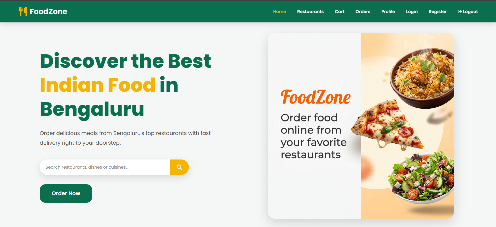
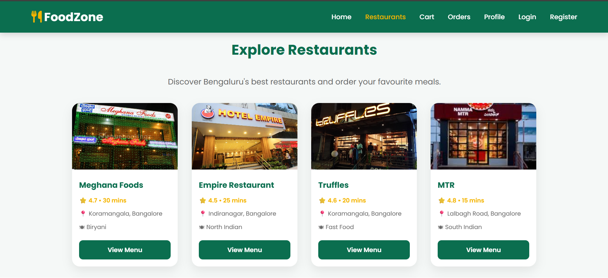
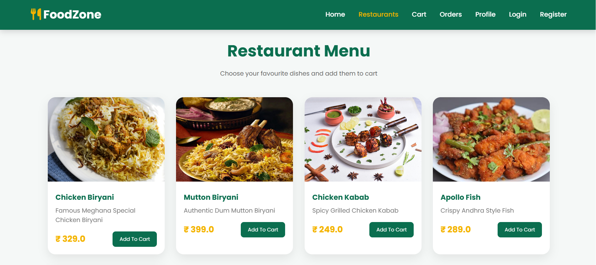
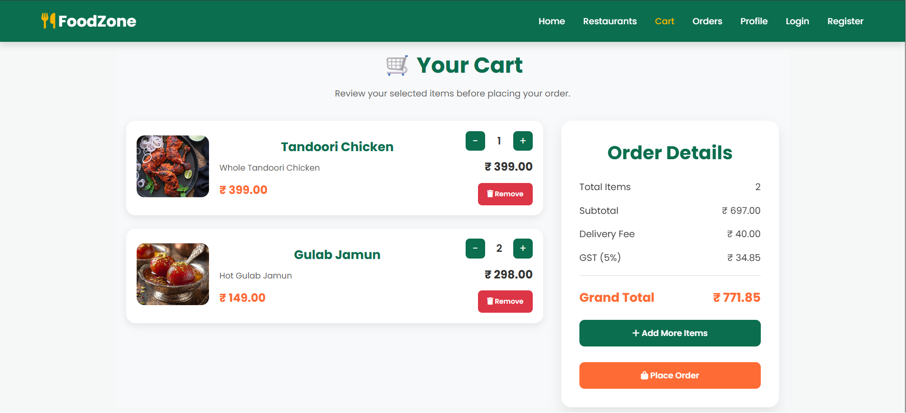
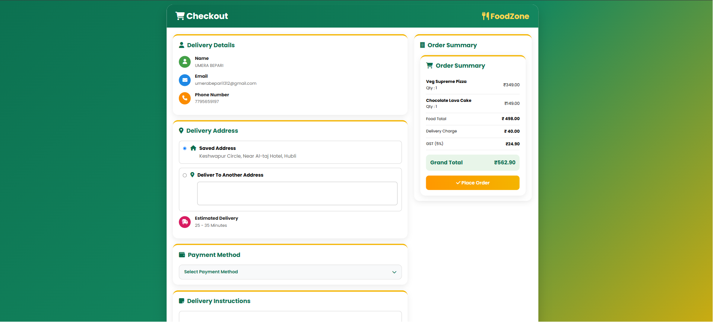
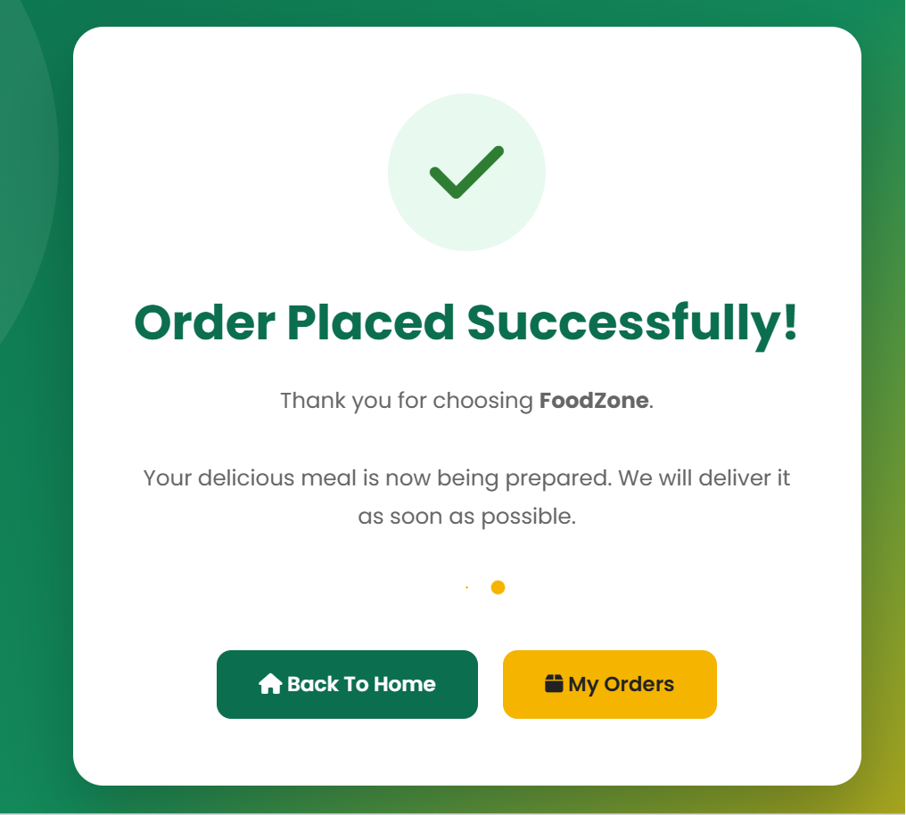
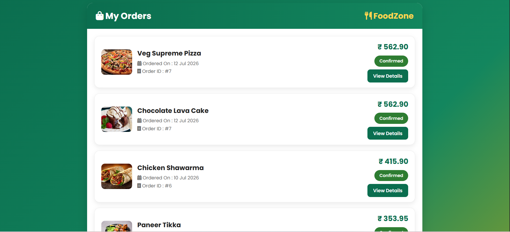
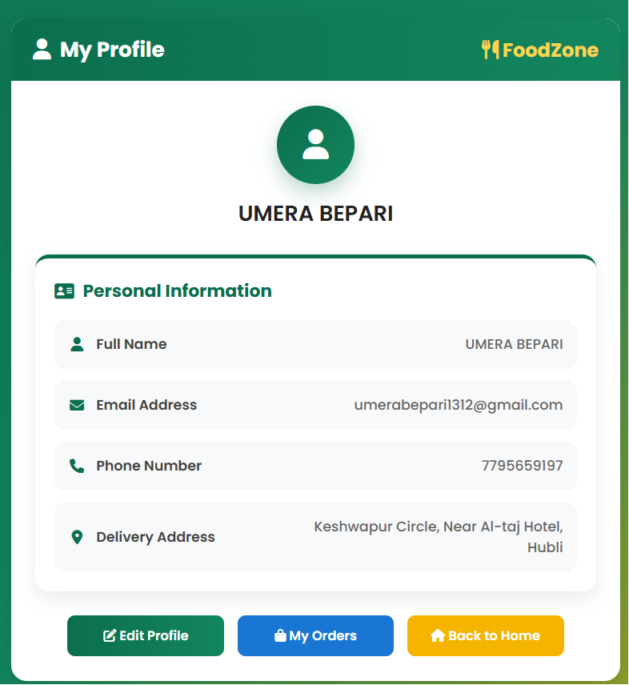
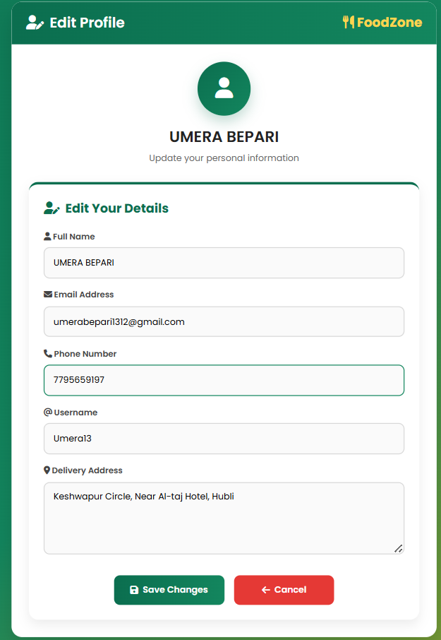

# 🍽️ FoodZone - Online Food Delivery Web Application

FoodZone is a full-stack online food delivery web application developed using Java Full Stack technologies. The application enables users to browse restaurants, explore menus, search for food items or restaurants, manage their cart, place orders, and track their order history through a clean and responsive interface.

---

## 📌 Project Overview

FoodZone is designed to simplify the online food ordering experience by providing a user-friendly platform where customers can:

- Browse restaurants
- View restaurant menus
- Search restaurants or menu items
- Add food items to cart
- Place food orders
- View previous orders
- Manage their profile

The project follows the **MVC (Model-View-Controller)** architecture and uses **JDBC** for database connectivity with **MySQL**.

---

# ✨ Features

### 👤 User Authentication
- User Registration
- User Login
- Logout
- Session Management

### 🍴 Restaurant Module
- Browse restaurants
- View restaurant details
- Restaurant-wise menu display

### 🔍 Search Functionality
- Search restaurants
- Search menu items
- Instant navigation to search results

### 🛒 Cart Module
- Add food to cart
- Update quantity
- Remove items
- Calculate total amount

### 📦 Order Module
- Place Orders
- Order Confirmation
- View Order History
- Order Details

### 👤 User Profile
- View Profile
- Edit Profile
- Update Username
- Update Email
- Update Phone Number
- Update Address

### 🎨 UI Features
- Responsive Design
- Animated Hero Section
- Hover Effects
- Modern Card Layout
- Attractive Green & White Theme

---

# 🛠️ Tech Stack

## Frontend
- HTML5
- CSS3
- JavaScript
- JSP

## Backend
- Java
- Servlets
- JDBC

## Database
- MySQL

## Server
- Apache Tomcat 10

## IDE
- Eclipse IDE

---

# 🏗️ Project Architecture

```
MVC Architecture

Model
│
├── User
├── Restaurant
├── Menu
├── Cart
├── Order
└── OrderHistory

↓

Controller

Servlets

↓

View

JSP Pages

↓

Database

MySQL
```

---

# 📂 Project Structure

```
FoodZone
│
├── src
│   ├── controller
│   ├── dao
│   ├── daoimpl
│   ├── model
│   ├── servlet
│   └── util
│
├── WebContent
│   ├── css
│   ├── images
│   ├── js
│   ├── WEB-INF
│   ├── index.jsp
│   ├── restaurants.jsp
│   ├── menu.jsp
│   ├── cart.jsp
│   ├── checkout.jsp
│   ├── profile.jsp
│   ├── editProfile.jsp
│   ├── myOrders.jsp
│   └── login.jsp
│
└── database
    └── foodzone.sql
```

---

# 💻 Modules

- Authentication Module
- Restaurant Module
- Menu Module
- Search Module
- Cart Module
- Checkout Module
- Order Module
- User Profile Module

---

# 🗄️ Database Tables

- User
- Restaurant
- Menu
- Cart
- CartItem
- Orders
- OrderItem

---

# 📸 Application Screens

### Home Page


### Restaurants Page


### Menu Page


### Cart Page


### Checkout Page


### Order Confirmation


### My Orders


### User Profile


### Edit Profile


---

# 🚀 How to Run the Project

### Clone the Repository

```bash
git clone https://github.com/umera13/FoodZone-Online-Food-Delivery-App.git
```

### Import Project

- Open Eclipse IDE
- Import Existing Maven Project
- Configure Apache Tomcat
- Configure MySQL Database

### Create Database

Import

```
foodzone.sql
```

into MySQL.

### Configure Database

Update your database credentials in:

```
DBConnection.java
```

### Run

Deploy the project on Apache Tomcat and open:

```
http://localhost:8080/FoodZone
```

---

# 🎯 Future Enhancements

- Online Payment Gateway
- Live Order Tracking
- Restaurant Admin Panel
- Delivery Partner Module
- Email Notifications
- OTP Verification
- Wishlist
- Coupons & Offers
- Reviews and Ratings
- AI-based Food Recommendations

---

# 👨‍💻 Developed By

**Umera Bepari**

Java Full Stack Developer

---

## ⭐ If you like this project, don't forget to Star this repository!
